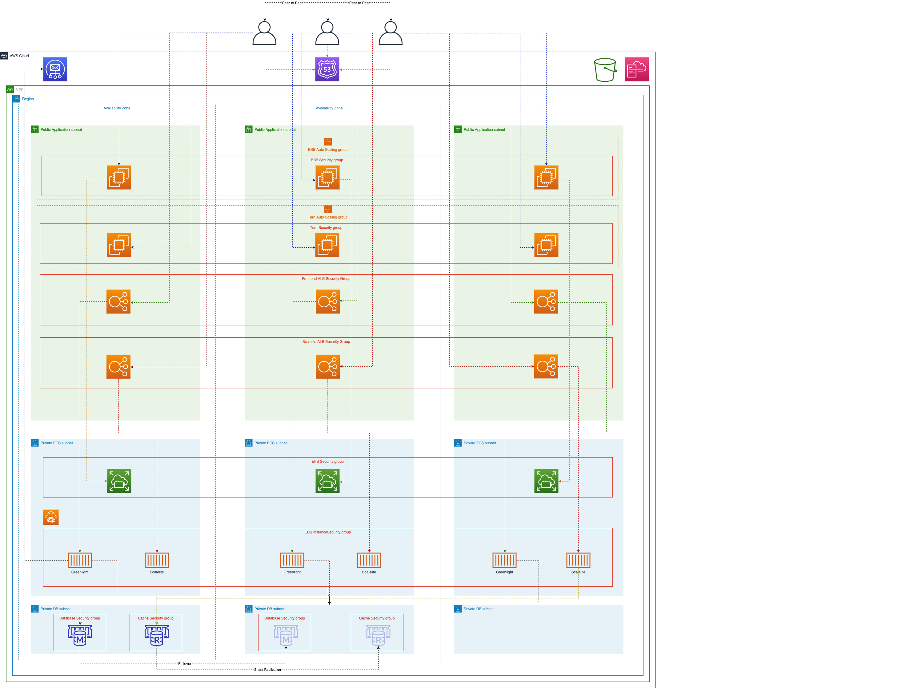

***Status:** Work-in-progress. Please create issues or pull requests if you have ideas for improvement.*

# **Scalable Big Blue Button Video Conference Example**
Example deployment of a scalable Video Conference System

## Summary
This project demonstrates the deployment of a scalable Video Conference Setup jointly using open-source software components and AWS Services. 

## High-Level architecture

### EC2 based deployment - architecture


### Serverless based deployment - architecture


## Disclaimer
This project is an example of an deployment and meant to be used for testing and learning purposes only. Do not use in production.

Please note that running this code will cause software that is licensed under [AGPL-3.0](https://www.gnu.org/licenses/agpl-3.0.de.html) to be deployed in the user’s account.

**Be aware that the deployment is not covered by the AWS free tier. Please use the [AWS pricing calculator](https://calculator.aws/#/estimate) to an estimation beforehand**

# Table of Contents

1. [Getting started](#Getting-started)
2. [Prerequisites](#Prerequisites)
3. [Parameters](#Parameters)
4. [Templates](#Templates)
5. [Code updates](#Code-updates)
6. [Versioning](#Versioning)
7. [Troubleshooting common errors](#Troubleshooting-common-errors)
8. [Resources](#Resources)
9. [Security](#Security)
10. [License](#License)

# Getting started

Just a few steps are needed to get started with the example deployment. 
the deployment process is separated in a prerequisites deployment containing the creation of the source file Amazon S3 Bucket and another containing the actual deployment of the infrastructure and application layer. 

You may use the included [setup script](./setup.sh) to simplify and [automatic deployment](#automatic) or alternatively you can run the deployment [step-by-step](#step-by-step). 

## Prerequisites

To run the automated, [setup script](./setup.sh) based deployment you need to have some software installed and configured on your device: 

- bash (zsh, csh, sh should also work, not tested though)
- an [installed and configured ](https://docs.aws.amazon.com/cli/latest/userguide/cli-chap-install.html) aws-cli
- [a named profile](https://docs.aws.amazon.com/cli/latest/userguide/cli-configure-profiles.html) at the aws-cli configuration reflecting the account you are planning to use for the deployment
- [jq](https://stedolan.github.io/jq/)

To run the step-by-step setup: 

- an [installed and configured ](https://docs.aws.amazon.com/cli/latest/userguide/cli-chap-install.html) aws-cli

either way you choose the following have to be in place: 

- a valid Route53 Hosted Zone (and it's ZoneID). Either a [registered](https://docs.aws.amazon.com/Route53/latest/DeveloperGuide/domain-register.html) Domain or an [external registered](https://docs.aws.amazon.com/Route53/latest/DeveloperGuide/migrate-dns-domain-in-use.html) Domain (at the target account)
- one or more valid Email Addresses
- Amazon Simple Email Service needs to either being [out of the Sandbox](https://docs.aws.amazon.com/ses/latest/DeveloperGuide/request-production-access.html) mode OR you need to [validate destination email adresses](https://docs.aws.amazon.com/ses/latest/DeveloperGuide/verify-email-addresses-procedure.html) piece by piece for the Invitation Emails

Be sure to check the [Troubleshooting common errors](#Troubleshooting-common-errors) when deploying. 

## Parameters

**Dynamic parameters**

These parameters you have to pass to the [setup script](./setup.sh) 

| Parameter Name | Value |
| --- | --- | 
| -p | the aws-cli profile to use | 
| -e | the operators email address |
| -h | the hosted zone ID the DNS records to be added | 
| -s | the Cloudformation stack name you want to use |
| -d | the FQDN for (aligned to the hosted zone ) |


**Deployment parameters:**

The deployment parameters are placed into the bbb-on-aws-param.json or to be set via cli/console ( if you choose the step-by-step setup. )

| Parameter Name | Default Value | Description | Comment |
| ---- | ---- | ---- | ---- |
| BBBApplicationVersion | xenial-22 | Big Blue Button Version to be deployed | Refer to the Big Blue Button [documentation](https://docs.bigbluebutton.org/) to check for supported versions. |
| BBBApplicationInstanceOSVersion | xenial-16.04 | Big Blue Button Application Instance OS Version to be deployed | Refer to the Big Blue Button [documentation](https://docs.bigbluebutton.org/) to check for supported versions of Ubuntu for the application version you set using "BBBApplicationVersion" parameter. |
| BBBTurnInstanceOSVersion | bionic-18.04 | Big Blue Button Turn Instance OS Version to be deployed | Refer to the Big Blue Button [documentation](https://docs.bigbluebutton.org/) to check for supported versions of Ubuntu for the application version you set using "BBBApplicationVersion" parameter. |
| BBBECSInstanceType| t3a.large| Instance size of the ECS Cluster worker nodes or "fargate" for serverless deployment | EC2 instance sizes should be aligned with the size VCPU and Memory limits of the to be deployed tasks. setting this parameter to fargate will cause a Serverless Setup using AWS Fargate |
| BBBApplicationInstanceType| t3a.xlarge| Instance size of the Big Blue Button Application node(s) | please refer to the Big Blue Button [Documentation](https://docs.bigbluebutton.org/2.2/install.html#minimum-server-requirements) for rightsizing |
| BBBApplicationDataVolumeSize | 20 | the size of the application data volume used for recording buffer |
| BBBApplicationRootVolumeSize | 20 | the size of the application root volume |
| BBBTurnInstanceType| t3.micro| Instance size of the turn server | For right sizing please refer to the Big Blue Button [Documentation](https://docs.bigbluebutton.org/2.2/setup-turn-server.html)
| BBBDBInstanceType| db.t3.medium| Instance size of the Aurora Database Instance or "serverless" for serverless deployment | Heavily related to usage, collect metrics and test. 
| BBBCACHEDBInstanceType| cache.t3.micro| Instance size of the Redis security token and call ID handling | Depends on usage. 
| BBBVPC| 10.1.0.0/16 | The Cidr block or ID for the VPC created during the deployment | we deploy an own VPC for the deployment containing public and private subnets as well nas internet and nat gateways. If an ID is passed over (vpc-*) the deployment will use the existing custom VPC and it's subnets. be sure to add the subnet ids into the parameters as well! 
| BBBPrivateApplicationSubnets| 10.1.5.0/24,10.1.6.0/24,10.1.7.0/24 | The cidr blocks or IDs of subnets within the VPC for the non-public components of the application deployment | count have to be = BBBNumberOfAZs
| BBBPrivateDBSubnets| 10.1.9.0/24,10.1.10.0/24,10.1.11.0/24| The cidr blocks or IDs of subnets within the VPC for the database backend. | count have to be = BBBNumberOfAZs
| BBBPublicApplicationSubnets| 10.1.15.0/24,10.1.16.0/24,10.1.17.0/24| The cidr blocks or IDs of subnets within the VPC for the direct public accessible application components | count have to be = BBBNumberOfAZs
| BBBNumberOfAZs | 3 | Number of AZs to be utilized by the deployment | valid value 1,2 or 3 
| BBBECSMaxInstances| 10| The maximum amount of instances the ECS cluster should scale out to | set a reasonable maximum to prevent cost explosion on unexpected usage
| BBBECSMinInstances| 1| The minimum amount of worker instances at the ECS cluster| 
| BBBECSDesiredInstances| 3| The desired amount of instances of worker instances at the ECS cluster |
| BBBApplicationMaxInstances| 1| The maximum amount of Big Blue Button Application servers | Set depending on the awaited load and planned instance size. | 
| BBBApplicationMinInstances| 1| The minimum amount of Big Blue Button Application servers | As EC2 Autoscaling is currently not aware of ongoing video conferences, i recommend set min=max=desired and not use dynamic here (planned scale out/in) | 
| BBBApplicationDesiredInstances| 1| The desired amount of Big Blue Button Application servers | As EC2 Autoscaling is currently not aware of ongoing video conferences, i recommend set min=max=desired and not use dynamic here (planned scale out/in) | 
| BBBTurnMaxInstances| 1| The maximum amount of Turn Servers to be deployed | at the current state leave it to 1. Multiple Turn servers will need additional configuration on the turnserver
| BBBTurnMinInstances| 1| The minimum amount of Turn Servers to be deployed | at the current state leave it to 1. Multiple Turn servers will need additional configuration on the turnserver
| BBBTurnDesiredInstances| 1| The desired amount of Turn Servers to be deployed | at the current state leave it to 1. Multiple Turn servers will need additional configuration on the turnserver
| BBBDBName| frontendapp| Set a Database Name for Greenlight / Scalelite | 
| BBBDBEngineVersion| 10.7| Set the Postgres version to be used at the Amazon Aurora setup | please refer to the Amazon Aurora [documentation](https://docs.aws.amazon.com/AmazonRDS/latest/AuroraUserGuide/AuroraPostgreSQL.Updates.20180305.html) for supported versions
| BBBEnvironmentStage| dev | can be set to "dev","stage" or "prod" | currently stage or prod does change the Amazon Aurora Setup to a Multi-AZ Setup and adds a 2nd Nat-Gateway to the deployment. 
| BBBServerlessAuroraMinCapacity | The minimum capacity for the Amazon Aurora Serverless Cluster. | Value has to be >= 2
| BBBServerlessAuroraMaxCapacity | The maximum capacity for the Amazon Aurora Serverless Cluster.
| BBBEnvironmentName| bbbonaws| the name of the environment 
| BBBEnvironmentType| scalable| can be either "scalable" or "single" | scalable for full scalable deployments. Single does leave out the ECS cluster, scalelite inner-application load balancer and Databases and installs Big Blue Button and Greenlight on a single EC2 instance and a turn server instance. 
| BBBgreenlightImage| bigbluebutton/greenlight:v2| greenlight container image to be used 
| BBBScaleliteApiImage| blindsidenetwks/scalelite:v1-api| scalelite api container image to be used
| BBBScaleliteNginxImage| blindsidenetwks/scalelite:v1-nginx| scalelite nginx container image to be used
| BBBScalelitePollerImage| blindsidenetwks/scalelite:v1-poller| scalelite poller container image to be used
| BBBScaleliteImporterImage| blindsidenetwks/scalelite:v1-recording-importer| scalelite recording importer container image to be used
| BBBCacheAZMode| cross-az| Deploy the Redis cluster cross-az or single-az | only cross-az supported atm
| BBBGreenlightMemory| 1024 | memory limit of the Greenlight task 
| BBBGreenlightCPU| 512| vCPU limit of the Greenlight task 
| BBBScaleliteMemory | 2048 | Memory limit for the Scalelite tasks | setting per task for all inheritated containers
| BBBScaleliteCPU | 1024 | vCPU limit for the Scalelite tasks if deployed | setting once per task for all containers
| BBBSesRegion| - | Region of the SES Service to be used | if the setup is planned to be deployed in a Region w/o Amazon SES, choose a proper region here. 

# Deployment

## Automatic

For the automatic deployment just run the included [setup script](./setup.sh) 

Example: 
```
./setup.sh -e johndoe@example.com -p bbb_example -h 1XXX02XXXXBMXXXXXZXXXX -s bbbexample -d bbbexample.example.com
```

The automatic deployment works as follows: 

- The [setup script](./setup.sh) will validate the device prerequisites are met and all needed parameters are set. 
- It will then validate the syntax of the Amazon Cloudformation templates prior to execute any deployment. 
- It's going to deploy the Amazon S3 Bucket needed by the main deployment and read out the Bucket name as well as the name of the Stack deployed. 
- It will copy the needed scripts, config files for application and services as well as nested templates to the the deployed Bucket. 
- The main deployment will be executed. The script will read the content of the  [bbb-on-aws-param.json](./bbb-on-aws-param.json) file and pass it through the stack deployment

# Step-by-step

If you want to attempt the deployment step-by-step via Console or aws-cli please use the following steps: 

- deploy the Source Amazon S3 Bucket for scripts, config files and nested templates

```
aws cloudformation deploy --stack-name bbbexample-sources --profile=bbb_example --template ./templates/bbb-on-aws-buildbuckets.template.yaml
```

- copy the content of the [templates](./templates) abd [scripts](./scripts) into the Source Bucket

````
    aws s3 sync --profile=bbb_example ./templates s3://NAMEOFCREATEDBUCKET
    aws s3 sync --profile=bbb_example ./scripts s3://NAMEOFCREATEDBUCKET
````

- start the deployment using the stackname of the stack deployed beforehand as one of the parameters:

using aws-cli: 
```
aws cloudformation deploy --profile=bbb_example --stack-name bbbexample \
    --capabilities CAPABILITY_NAMED_IAM \
    --parameter-overrides BBBOperatorEMail=johndoe@example.com BBBStackBucketStack=bbbexample-sources BBBDomainName=bbbexample.example.com BBBHostedZone=1XXX02XXXXBMXXXXXZXXXX \
    --template ./bbb-on-aws-master.template.yaml
```

The deployment will take approx 30-45 minutes. 

# Logging into the Big Blue Button: 

When deployment went through you find the Administrator login within [Secretsmanager](https://console.aws.amazon.com/secretsmanager/home#/listSecrets). The password is located at the secret starting with **BBBAdministratorlogin-**
While your login has been set to your selected Operator Email Address the password has been generated for you. 

log into the Frontend using **conference**.example.com 

# Template structure and deployment workflow

The Deployment consists of 2 main templates and 13 nested templates. 

## Main templates

- The deployment of prerequisites via [bbb-on-aws-buildbuckets.template.yaml](./templates/bbb-on-aws-buildbuckets.template.yaml)

    The template deploys the Amazon S3 Bucket containing the scripts used at the turn, application and scalelite deployment as well as the nested templates source files.
---
- The Master Template for the main deployment [bbb-on-aws-master.template.yaml](./bbb-on-aws-master.template.yaml)

    The template initiates the overall deployment of the scaling Big Blue Button example deployment. 
---
## Nested templates

- Providing the Certificate Automation via: [bbb-on-aws-acmcert.template.yaml](./templates/bbb-on-aws-acmcert.template.yaml)

    *This template deploys a custom resource into your AWS Account which provides full automation of requesting and validating Amazon Certificate manager based TLS Certificates. The validation will be done via Route53 DNS records.* 
---
- Dynamically provide the latest AMI to be used with: [bbb-on-aws-amifinder.template.yaml](./templates/bbb-on-aws-amifinder.template.yaml)

    *The template deploys a custom resource into your AWS Account which will access the AWS API to find the ami of the desired non-Amazon Linux Operating System.* 
---
- Setup Email sending via Amazon SES: [bbb-on-aws-ses.template.yaml](./templates/bbb-on-aws-ses.template.yaml)

    *This template deploys a custom resource which fully automates the Amazon SES configuration for sending mails and validating the domains in Amazon SES via Route53 records.*
---
- Building the network infrastructure using: [bbb-on-aws-network.template.yaml](./templates/bbb-on-aws-network.template.yaml)

    *The template deploys a full Amazon VPC with public and private subnets, route tables, internet gateways, nat gateways.* 
---
- Create needed Security Groups: [bbb-on-aws-securitygroups.template.yaml](./templates/bbb-on-aws-securitygroups.template.yaml)

    *This template creates all needed security groups for service exposure as well as application backend communication* 
---
- Provisioning of the Shared Storage: [bbb-on-aws-storage.template.yaml](./templates/bbb-on-aws-storage.template.yaml)

    *This template deploys an Amazon Elastic File System into the setup to provide shared storage for the video conference recordings*
---
- Deploy Amazon Aurora (Postgres): [bbb-on-aws-database.template.yaml](./templates/bbb-on-aws-database.template.yaml)

    *The deployment of Amazon Aurora is needed to provide a database for Greenlight and Scalelite where the video conference schedules, user data and recording information are persistent*
---
- Deploy Amazon Elasticache (Redis): [bbb-on-aws-cachedb.template.yaml](./templates/bbb-on-aws-cachedb.template.yaml)

  *This template deploys an Amazon Elasticache (redis) cluster where security token and conference IDs are located for the call handling via Scalelite*
--- 
- Fire up the ECS Cluster: [bbb-on-aws-ecs.template.yaml](./templates/bbb-on-aws-ecs.template.yaml)

    *The template deploys the ECS cluster and EC2 Autoscaling Group with the Launch Configuration for the Amazon EC2 worker nodes. If the parameter BBBECSInstanceType is set to "fargate" the ECS Cluster will be utilizing AWS Fargate for the tasks and EC2 worker instances as well as Autoscaling Groups will not be created*
---
- Add a turnserver to the stack: [bbb-on-aws-bbbturn.template.yaml](./templates/bbb-on-aws-bbbturn.template.yaml)

    *We need a turn server to handle the video call if the attendees are located behind a restrictive firewall*
---
- Initiate the frontend and inner-application load balancer to the ECS Cluster: [bbb-on-aws-frontendapps.template.yaml](./templates/bbb-on-aws-frontendapps.template.yaml)

  *Greenlight is providing the interface for the Users and the video conference landing page. Scalelite is the inner-application load balancer which provides conference load balancing over multiple big blue button application servers* 
---  
- Setting up the Big Blue Button Application Instance(s): [bbb-on-aws-bbbappscalable.template.yaml](./templates/bbb-on-aws-bbbappscalable.template.yaml) (for single server deployments [bbb-on-aws-bbbappsingle.template.yaml](./templates/bbb-on-aws-bbbappsingle.template.yaml)) 

    *Finally we will deploy the Big Blue Button application instances. Each instance is basically a separate video conference system.*
---

## Custom scripts 

During the deployment the EC2 instances will be bootstrapped using UserData. To orchestrate the turn and Big Blue Button servers we will deploy some custom scripts helping to glue the components of the system

- route53-handler [systemd service](./scripts/route53-handler.service) and [script](./scripts/route53-handler.sh)
    *deployed to the application and turn server instances creates dynamic records in your hosted zone (Route53) on boot/bootstrap of an instance and removes the record from the hosted zone. <br>
    We do not use ElasticIPs or fixed hostnames at the setup to prevent e.g. service quotas. Also we use dynamic hostnames for each bootstrapped instance to prevent e.g. Let's encrypt penalties*
---
- scalelite-handler [systemd service](./scripts/scalelite-handler.service) and [script](./scripts/scalelite-handler.sh)
    *deployed to each application instance adds the instance to scalelite on boot/bootstrap as active video conference instance and evaluates/removes the instance on shutdown" 
---
- turn-handler [systemd service/timer](./scripts/turn-handler.service) and [script](./scripts/turn-handler.sh)
    *the turn-handler the currently active turnserver hostname can be found by the application instances. As we dynamically set hostnames the turn servername might change on scaling or termination events. the turn-handler is started via systemd timer every X seconds*
--- 
- scalelite post [script](./scripts/scalelite_post_publish.rb) and [config](scalelite.yml)
    *the script and config files are added to the Big Blue Button application instances to enable the recordings import into scalelite and Amazon EFS*

## Configuration adjustments (diffs from the defaults)

- Cloudwatch Agent for [application](./scripts/bbb-cwagent.config) and [turn](./scripts/turn-cwagent.config) instances
    *the agent is automatically setup via UserData on bootstrap. To sent valid data to the Amazon Cloudwatch Service a custom agent config is used for application and turn servers* 

## Customizing your Big Blue Button deployment

There are several ways how you can further customize your deployment. Apart from the infrastructure components you can customize using the parameters mentioned earlier at the documentation you can also adjust the bootstrap of the Big Blue Button or Greenlight deployment according to your needs. A good starting point is to take a look at the UserData Section of the nested stack for the application instances like: [bbb-on-aws-bbbappscalable.template.yaml](./templates/bbb-on-aws-bbbappscalable.template.yaml) (for single server deployments [bbb-on-aws-bbbappsingle.template.yaml](./templates/bbb-on-aws-bbbappsingle.template.yaml)) 

Our recommendation is to hook into the bootstrap and alter/extend the Scripts and/or code there. this makes sure your customization will be persistent for all of your deployments and also if you decide to scale-out the application servers. Basically the [customization section of the Big Blue Button documentation](https://docs.bigbluebutton.org/2.2/customize.html) does content all steps you need. 

When it comes to Greenlight there is also a part at the [official documentation](https://docs.bigbluebutton.org/greenlight/gl-customize.html) covering this. As we do use the containerized version of the Greenlight deployment at the scalable option the best way to approach it is to customize and extend the related Greenlight container, push it into your private container registy. [Amazon ECR](https://aws.amazon.com/ecr/) or any docker compatible registry of your choise. And continue with your customized container image setting the related parameter. 

# Code updates

to update an already deployed stack just pull the current version of the IaC code repository. Afterwards you can start the upgrade process the same way as you would do the initial setup. 

# Versioning

We're using the [Semantic Versioning](https://semver.org/) for this repo. Each major release will be tagged and can be pulled seperately. 
Be sure NOT to use the main branch if you want to be sure not pulling potential huge changes to the infrastrucutre unintentionally. Use the branches regarding to the major Version you want to stick to. 

---
# Troubleshooting common errors

- Failed to create: [BBBTurnAutoScaling] Issue: 

    One of the most common errors is, that the Hosted Zone metioned at the Prerequisites is not setup properly or you're at the state of DNS delay. Use the following commands on your command line to evaluate if your DNS Setup is working: 

    ```nslookup thedomain.setupashosted.zone```

    This should reply with some basic domain information like assigned DNS Servers. If you get a domain not found error wait a bit if you're sure you followed the docomentation above ( [registered](https://docs.aws.amazon.com/Route53/latest/DeveloperGuide/domain-register.html) Domain or an [external registered](https://docs.aws.amazon.com/Route53/latest/DeveloperGuide/migrate-dns-domain-in-use.html) Domain (at the target account) ) and try like 10min later. If still no results, check your hosted zone and DNS setup. 
    If you use an external Registar (and did not buy a domain using Route53) make sure you registered the Route53 DNS Servers with the Domain as mentioned at the related [documentation](https://docs.aws.amazon.com/Route53/latest/DeveloperGuide/migrate-dns-domain-in-use.html). 
    
    You do need an own domain to deploy in any case. you cannot mock it using bbb.example.com or any invalid setup here. 

- Failed to create: [BBBECSCapacityProvider] Issue: 
    
    There are some cases where the needed Service Role is non-existent at the target account. 
    Solution: Create the missing Service Role manually using the following aws-cli command:

    ```aws iam create-service-linked-role --aws-service-name ecs.amazonaws.com```

---
# Resources

- AWS Services
    - [Amazon Cloudformation](https://aws.amazon.com/cloudformation/)
    - [Amazon EC2](https://aws.amazon.com/ec2/)
    - [Amazon ECS](https://aws.amazon.com/ecs/)
    - [AWS Fargate](https://aws.amazon.com/fargate/)
    - [Amazon Aurora](https://aws.amazon.com/rds/aurora/)
    - [Amazon Elasicache](https://aws.amazon.com/elasticache/)
    - [AWS Systems Manager](https://aws.amazon.com/systems-manager/)
    - [AWS Secrets Manager](https://aws.amazon.com/secrets-manager/)
    - [AWS Certificate Manager](https://aws.amazon.com/certificate-manager/)
    - [Amazon Cloudwatch](https://aws.amazon.com/cloudwatch/)
    - [Amazon Route53](https://aws.amazon.com/route53/)
    - [Elastic Load Balancing](https://aws.amazon.com/elasticloadbalancing/)
    - [AWS Auto Scaling](https://aws.amazon.com/autoscaling/)
    - [Amazon EC2 Auto Scaling](https://aws.amazon.com/ec2/autoscaling/)
    - [Amazon Virtual Private Cloud](https://aws.amazon.com/vpc/)
    - [Amazon Elastic File Service](https://aws.amazon.com/efs/)
    - [Amazon Simple Email Service](https://aws.amazon.com/ses/)
    - [Amazon S3](https://aws.amazon.com/s3/)

- Open Source Projects
    - [Big Blue Button](https://github.com/bigbluebutton/bigbluebutton)
    - [Greenlight](https://github.com/bigbluebutton/greenlight)
    - [Scalelite](https://github.com/blindsidenetworks/scalelite)
    - [Coturn](https://github.com/coturn/coturn)
    - [cfn-ses-provider](https://github.com/binxio/cfn-ses-provider)
    - [cfn-certificate-provider](https://github.com/binxio/cfn-certificate-provider)
    - [cli53](https://github.com/barnybug/cli53)

# Security

See [CONTRIBUTING](CONTRIBUTING.md#security-issue-notifications) for more information.

# License

This Example is licensed under the MIT-0 License. See the LICENSE file.

## 3rd party Licensing

Please be aware of the deviating licenses of the deployed open-source software components. 

- Big Blue Button: [GNU Lesser General Public License v3.0](https://github.com/bigbluebutton/bigbluebutton/blob/develop/LICENSE)
- Greenlight: [GNU Lesser General Public License v3.0](https://github.com/bigbluebutton/greenlight/blob/master/LICENSE)
- Scalelite: [GNU Affero General Public License v3.0](https://github.com/blindsidenetworks/scalelite/blob/master/LICENSE)
- cli53: [MIT License](https://github.com/barnybug/cli53/blob/master/LICENSE)
- Coturn: [New BSD License](https://github.com/coturn/coturn/blob/master/LICENSE)
- cfn-ses-provider - [Apache-2.0 License](https://github.com/binxio/cfn-ses-provider/blob/master/LICENSE)
- cfn-certificate-provider - [Apache-2.0 License](https://github.com/binxio/cfn-certificate-provider/blob/master/LICENSE)

Please note that running this code will cause software that is licensed under [AGPL-3.0](https://www.gnu.org/licenses/agpl-3.0.de.html) to be deployed in the user’s account.